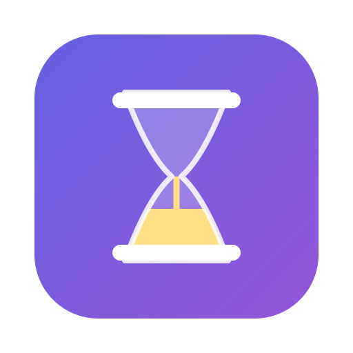
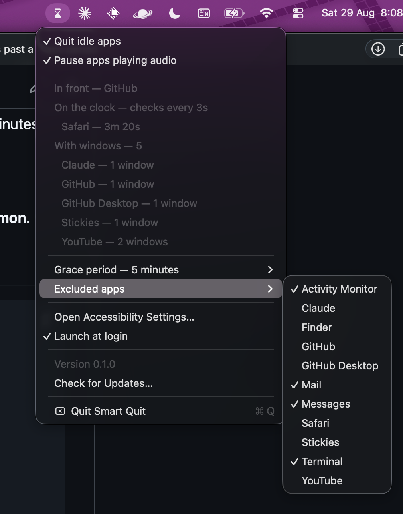
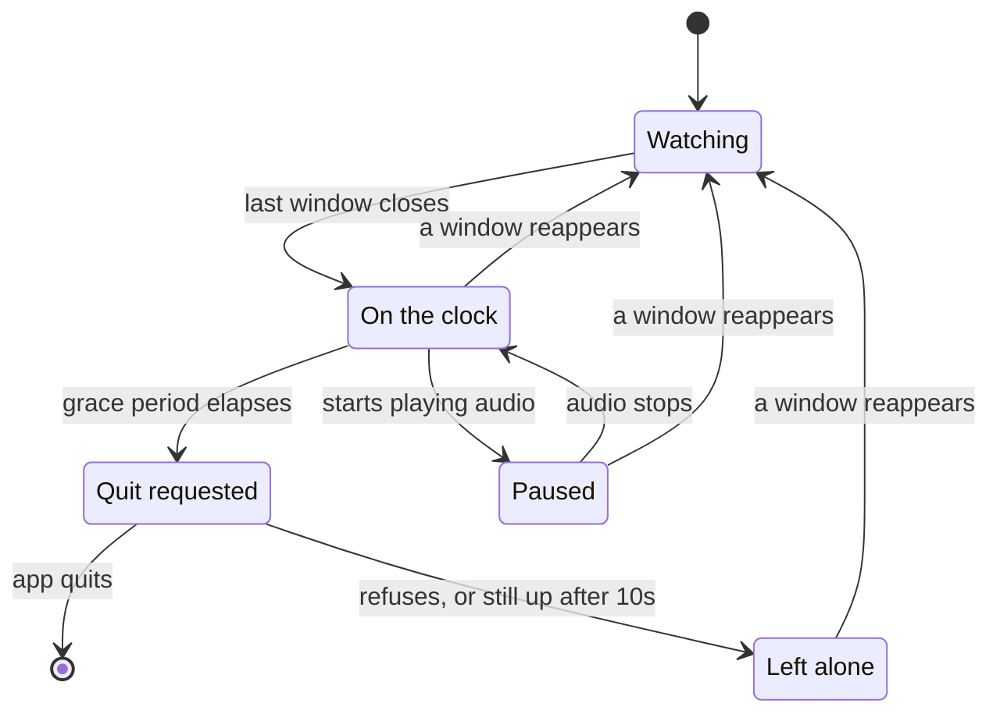

<p align="center">
  
</p>

<h1 align="center">Smart Quit</h1>

<p align="center">
  <strong>Your Mac keeps apps running after you close their last window.</strong><br>
  That's a feature — right up until it's thirty of them 😅.
</p>

<p align="center">
  <a href="https://github.com/aswinmurali-io/smart_quit/actions/workflows/ci.yml"></a>
  
  
  
  
</p>

<p align="center">
  <a href="https://github.com/aswinmurali-io/smart_quit/releases/latest"></a>
</p>

<p align="center">
  <sub>Notarised by Apple · macOS 14.2 Sonoma or later · 1.3 MB</sub>
</p>

---

Closing a window on macOS doesn't quit the app. It lingers in the background,
ready for an instant relaunch — which is genuinely useful, and also how you end
up at 6pm with two dozen windowless apps quietly holding memory.

Smart Quit keeps the instant relaunch and drops the pile-up. Close the last
window, walk away, and a few minutes later the app quits itself — gracefully,
with every unsaved-changes dialog intact.

It lives in the menu bar. **No Dock icon, no window, no preferences pane.**

**The built app is 1.3 MB — native Swift and AppKit, no Electron, no bundled
runtime, no background daemon**.

## What it looks like

<p align="center">
  
</p>

The hourglass icon fills as apps go on the clock, and dims when you pause it.
Countdowns tick live while the menu is open.

## Download

Needs macOS 14.2 Sonoma or later.

**[Get the latest `.dmg`](https://github.com/aswinmurali-io/smart_quit/releases/latest)**
— signed with a Developer ID certificate and notarised by Apple, so it opens
without a Gatekeeper warning. Drag *Smart Quit* to Applications, launch it, and
look for the hourglass in the menu bar.

Then [grant Accessibility permission](#grant-accessibility-permission) — the app
does nothing until you do.

## How it decides



One timer sweeps every app every 3 seconds — not a timer per app.

**Paused** holds the clock rather than resetting it. Close Spotify's window
mid-album and it stops counting down; when the music ends it resumes from the
time it had left, not from the top.

An app that refuses to quit lands in **Left alone** and is never asked again
until it shows a window. Otherwise an app holding unsaved work would get a save
dialog every few seconds, forever.

## What it will never quit

| | Why |
|---|---|
| **The app you're looking at** | Its clock keeps running, so it goes the moment you switch away — but never while it's in front of you. The menu names it, and marks its row *(foreground)*. |
| **Anything with unsaved work** | Quitting is `terminate()`, never `terminate(force:)`. The app shows its save dialog and refuses. That's the correct outcome, not a failure. |
| **Apps it couldn't inspect** | An unreadable window count is *unknown*, never *zero*. Without that distinction, a hung app — or a revoked permission — reads as windowless and gets quit. |
| **Minimized or hidden apps** | Both still count as having windows. A minimized window is work in progress. |
| **Finder, menu bar utilities, background agents** | Windowless by design. Only regular, Dock-visible apps are eligible. |
| **Anything playing audio** | Its clock pauses for as long as the sound lasts — including audio coming from a helper process, so a browser tab or an Electron app counts too. Turn it off with *Pause apps playing audio* and every held clock resumes from where it stopped. |
| **Your exclude list** | Music, Mail, Messages, Calendar, Activity Monitor, Terminal and iTerm are excluded out of the box. Toggle any running app from the menu. |

## Install

Everything past the download: building it yourself, the permission it needs, and
where to keep it.

### Build from source

Needs the Xcode command line tools.

```bash
./Scripts/build-app.sh
```

That builds `dist/Smart Quit.app`, signing it with the Apple Development
certificate in your keychain when there is exactly one. Then:

```bash
cp -R "dist/Smart Quit.app" ~/Applications/ && open ~/Applications/"Smart Quit.app"
```

For a disk image instead:

```bash
./Scripts/make-dmg.sh
```

That writes `dist/SmartQuit-0.1.0.dmg` — a drag-to-Applications installer, named
for the version in `Info.plist`. It works on the Mac that built it; handing it
to someone else needs the notarised build below.

> **Why no `.xcodeproj`?** Smart Quit is a Swift package: the logic lives in a
> library target so `swift test` runs against it directly, and a script
> assembles the `.app` bundle a menu bar app needs. No unmergeable project XML.

### Grant Accessibility permission

**Smart Quit does nothing until you grant this.** It reads window counts through
the Accessibility API — it cannot see window contents, only how many windows
each app has.

macOS asks on first launch. If you miss the prompt, open **System Settings →
Privacy & Security → Accessibility** and enable Smart Quit; the menu's *Open
Accessibility Settings…* item takes you straight there.

> macOS ties the grant to the app's code signature. Signing with a real
> certificate keeps it stable across rebuilds; an ad-hoc signature does not, and
> a stale record has to be cleared with
> `tccutil reset Accessibility com.smartquit.SmartQuit` before re-granting.
>
> Set `SMARTQUIT_SIGNING_ACCOUNT` to pick a certificate by Apple ID, or
> `CODESIGN_IDENTITY` to name one outright.

### Gatekeeper

The released `.dmg` is notarised and stapled — it opens by double-clicking, with
no warning and no right-click dance.

A build of your own is a different matter: a development certificate isn't
notarised, so on any Mac but the one that built it, double-clicking is blocked
the first time. Right-click `Smart Quit.app` → **Open** → **Open**, or launch
with `open` from the terminal.

To hand a build to someone else properly, `./Scripts/release.sh` builds a
notarised, stapled `.dmg`. It needs a Developer ID Application certificate and a
`notarytool` keychain profile, and says exactly what's missing if either isn't
there.

### Launch at login

Uses `SMAppService`, which registers the app by path. Keep `Smart Quit.app`
somewhere stable — `~/Applications` or `/Applications` — or the login item will
point at a file that has moved.

## Watching it work

Every state transition is logged. To follow along live:

```bash
log stream --predicate 'subsystem == "com.smartquit.SmartQuit"' --level debug
```

To read what already happened:

```bash
log show --predicate 'subsystem == "com.smartquit.SmartQuit"' --last 1h --info --debug
```

The `engine` category records apps becoming windowless, clocks being cancelled,
quit requests, quits that went through, and quits that were refused.

## Tests

```bash
swift test
```

The decision engine, settings, menu structure and duration formatting are
covered directly. The engine takes the current time as a parameter, so the
timing tests are exact and finish in milliseconds instead of sleeping.

Window counting is covered at its seams — the subrole filter, and the mapping
from `AXError` to "no windows" versus "unknown" — rather than against a live
window server. The sweep's threading is covered for reentrancy and for
re-reading the frontmost app, which is the path that can quit the wrong app.

## Design notes

[`lat.md/`](lat.md) records the decisions and the reasoning behind them —
why the Accessibility API rather than `CGWindowList`, why an unknown window
count is not zero, why state is keyed by pid, and why a refused quit is never
retried.

## Contributing

[CONTRIBUTING.md](.github/CONTRIBUTING.md) covers the setup, how the tests are
shaped, and what a pull request should say. Found a security problem? Please
report it privately — see [SECURITY.md](.github/SECURITY.md).

## Licence

GNU General Public License v3.0 — see [LICENSE](LICENSE).

Copyright © 2026 Aswin Murali.

Smart Quit is free software. Use it, read it, change it, pass it on. The one
condition is that anything you build out of it stays free the same way: ship the
source under the GPL too, and keep the copyright notice. A fork that goes closed
is the thing this licence exists to prevent.

That choice rules out the Mac App Store, whose terms add restrictions the GPL
forbids and whose signing model conflicts with the right to run your own build.
Smart Quit is distributed as a notarized `.dmg` instead, which is where
[Packaging](lat.md/packaging.md) already pointed it.
