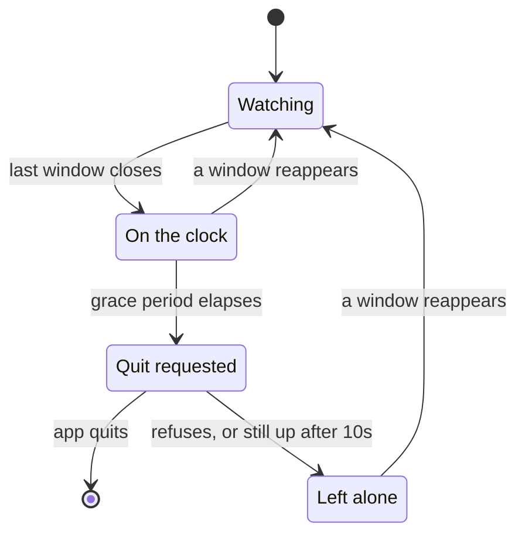

<h1 align="center">SmartQuit</h1>

<p align="center">
  <strong>Your Mac keeps apps running after you close their last window.</strong><br>
  That's a feature — right up until it's thirty of them.
</p>

<p align="center">
  
  
  
  
</p>

---

Closing a window on macOS doesn't quit the app. It lingers in the background,
ready for an instant relaunch — which is genuinely useful, and also how you end
up at 6pm with two dozen windowless apps quietly holding memory.

SmartQuit keeps the instant relaunch and drops the pile-up. Close the last
window, walk away, and a few minutes later the app quits itself — gracefully,
with every unsaved-changes dialog intact.

It lives in the menu bar. No Dock icon, no window, no preferences pane.

## What it looks like

```
✓ Quit idle apps
──────────────────────────────
  On the clock
    Preview — 2m 15s
    Notes — 4m 03s
──────────────────────────────
  Grace period — 5 minutes    ▸
      1 minute
      2 minutes
    ✓ 5 minutes
      10 minutes
      30 minutes
      Custom…
      ────────────────────────
      Per-app grace periods   ▸
  Excluded apps               ▸
      Preview
      Notes
    ✓ Spotify
──────────────────────────────
  Open Accessibility Settings…
✓ Launch at login
──────────────────────────────
  Quit SmartQuit
```

The hourglass icon fills as apps go on the clock, and dims when you pause it.
Countdowns tick live while the menu is open.

## How it decides



One timer sweeps every app every 15 seconds — not a timer per app.

An app that refuses to quit lands in **Left alone** and is never asked again
until it shows a window. Otherwise an app holding unsaved work would get a save
dialog every 15 seconds, forever.

## What it will never quit

| | Why |
|---|---|
| **The app you're looking at** | Its clock keeps running, so it goes the moment you switch away — but never while it's in front of you. |
| **Anything with unsaved work** | Quitting is `terminate()`, never `terminate(force:)`. The app shows its save dialog and refuses. That's the correct outcome, not a failure. |
| **Apps it couldn't inspect** | An unreadable window count is *unknown*, never *zero*. Without that distinction, a hung app — or a revoked permission — reads as windowless and gets quit. |
| **Minimized or hidden apps** | Both still count as having windows. A minimized window is work in progress. |
| **Finder, menu bar utilities, background agents** | Windowless by design. Only regular, Dock-visible apps are eligible. |
| **Your exclude list** | Spotify, Music, Mail, Messages, Calendar, Activity Monitor, Terminal and iTerm are excluded out of the box. Toggle any running app from the menu. |

## Install

Needs macOS 13 Ventura or later and the Xcode command line tools.

```bash
./Scripts/build-app.sh
```

That builds `dist/SmartQuit.app` and ad-hoc signs it. Then:

```bash
cp -R dist/SmartQuit.app ~/Applications/ && open ~/Applications/SmartQuit.app
```

Look for the hourglass in the menu bar.

> **Why no `.xcodeproj`?** SmartQuit is a Swift package: the logic lives in a
> library target so `swift test` runs against it directly, and a script
> assembles the `.app` bundle a menu bar app needs. No unmergeable project XML.

### Grant Accessibility permission

**SmartQuit does nothing until you grant this.** It reads window counts through
the Accessibility API — it cannot see window contents, only how many windows
each app has.

macOS asks on first launch. If you miss the prompt, open **System Settings →
Privacy & Security → Accessibility** and enable SmartQuit; the menu's *Open
Accessibility Settings…* item takes you straight there.

> Ad-hoc signatures change on every rebuild, and macOS ties the Accessibility
> grant to the signature. After rebuilding you may need to remove SmartQuit from
> the list and add it back.

### Gatekeeper

An ad-hoc signature isn't notarised, so double-clicking may be blocked the first
time. Right-click `SmartQuit.app` → **Open** → **Open**. Launching with `open`
from the terminal avoids this entirely.

### Launch at login

Uses `SMAppService`, which registers the app by path. Keep `SmartQuit.app`
somewhere stable — `~/Applications` or `/Applications` — or the login item will
point at a file that has moved.

## Watching it work

Every state transition is logged. To follow along live:

```bash
log stream --predicate 'subsystem == "com.smartquit.SmartQuit"' --level debug
```

To read what already happened:

```bash
log show --predicate 'subsystem == "com.smartquit.SmartQuit"' --last 1h --info --debug
```

The `engine` category records apps becoming windowless, clocks being cancelled,
quit requests, and quits that were refused.

## Tests

```bash
swift test
```

The decision engine, settings, menu structure and duration formatting are
covered directly. The engine takes the current time as a parameter, so the
timing tests are exact and finish in milliseconds instead of sleeping.

Window counting is covered at its seams — the subrole filter, and the mapping
from `AXError` to "no windows" versus "unknown" — rather than against a live
window server. The sweep's threading is covered for reentrancy and for
re-reading the frontmost app, which is the path that can quit the wrong app.

## Design notes

[`lat.md/`](lat.md) records the decisions and the reasoning behind them —
why the Accessibility API rather than `CGWindowList`, why an unknown window
count is not zero, why state is keyed by pid, and why a refused quit is never
retried.

## Licence

Apache License 2.0 — see [LICENSE](LICENSE).
